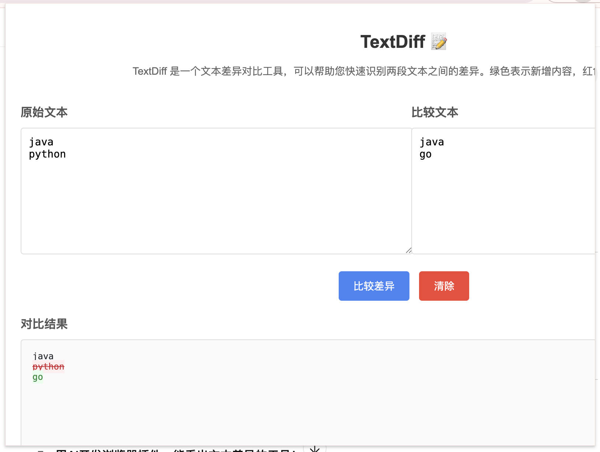

# TextDiff - 文本差异对比工具

TextDiff 是一个谷歌浏览器扩展，用于对比两段文本之间的差异并以高亮方式显示。它可以帮助你快速识别文本之间的添加、删除和未更改部分。

## 功能特点

- 简洁直观的用户界面
- 实时对比两段文本的差异
- 使用不同颜色高亮显示添加和删除的内容
- 支持多行文本比较
- 自动保存上次比较的文本

## 安装方法

### 方法一：从 Chrome 网上应用店安装（尚未发布）

1. 访问 Chrome 网上应用店
2. 搜索 "TextDiff"
3. 点击 "添加至 Chrome" 按钮

### 方法二：开发者模式安装

1. 下载本项目代码并解压到本地文件夹
2. 打开 Chrome 浏览器，在地址栏输入 `chrome://extensions/`
3. 在右上角启用 "开发者模式"
4. 点击 "加载已解压的扩展程序" 按钮
5. 选择包含本项目代码的文件夹
6. 扩展程序将被添加到 Chrome 浏览器中

## 使用方法

1. 点击 Chrome 工具栏中的 TextDiff 扩展图标（📝），打开插件弹窗
2. 在左侧文本框中输入或粘贴原始文本
3. 在右侧文本框中输入或粘贴要比较的文本
4. 点击 "比较差异" 按钮
5. 在下方结果区域查看高亮显示的文本差异：
   - 绿色背景：新增的内容
   - 红色背景：删除的内容
   - 正常显示：未更改的内容
6. 点击 "清除" 按钮可以清空所有文本框和结果

## 技术实现

TextDiff 使用最长公共子序列 (LCS) 算法来检测文本差异，并使用 HTML 和 CSS 来高亮显示这些差异。

## 隐私说明

TextDiff 完全在本地运行，不会将您的文本数据发送到任何服务器。您的文本仅存储在浏览器的本地存储中，以便在您下次使用时恢复。

## 许可证

本项目采用 MIT 许可证。详情请参阅 [LICENSE](LICENSE) 文件。

